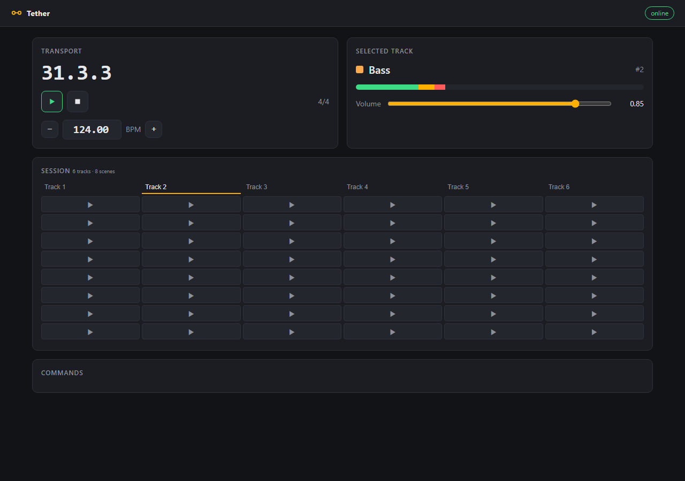
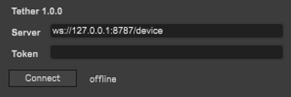
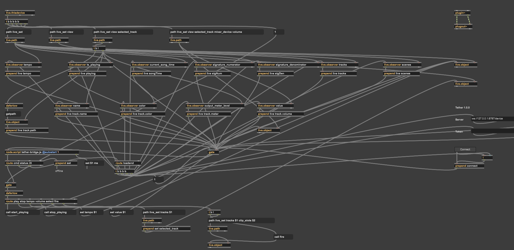
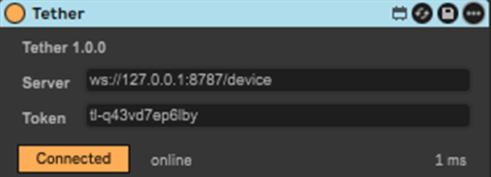

# Tether

> ## ⬇️ [Download Tether.amxd](Tether/)
> The Max for Live device is in the **[`Tether/`](Tether/)** folder, and on the
> [Releases](../../releases/latest) page as a zip. Keep `Tether.amxd` and
> `tether-bridge.js` together in the same folder.

Tether is a Max for Live device that links an Ableton Live Set to a server over WebSocket.

Drop it on any track and it starts streaming what the Set is doing to a small Node server:
tempo, play/stop, song position, time signature, and the selected track's name, colour,
volume and meter. The server can also send a handful of commands back, like play, stop,
change tempo, set volume, select a track or fire a clip. There's a browser dashboard on top,
so any laptop or phone on the network can watch and control the Set.



<p align="center"></p>

## Why I built it

I wanted to show how Max for Live, the Live API and Node for Max actually fit together
once there's a real network in the middle. Streaming values out is the easy part. The
interesting problems all sit at the edges:

- Live refuses changes made from inside its own notifications.
- Node for Max runs in a separate process that can't see the Live API at all.
- Connections drop.
- A frozen device has to ship its own code.

## Getting it running

**Just the device:** take `Tether.amxd` and `tether-bridge.js` from the [`Tether/`](Tether/)
folder, put them in the same place (your User Library works) and drag Tether onto a track.

**The server and dashboard:**

```bash
npm ci
npm run server    # prints a device URL, a token and a dashboard link
npm run sim       # optional: a fake Live Set, handy when Live isn't open
npm run build     # rebuilds Tether/Tether.amxd and Tether/tether-bridge.js from source
```

1. Open the dashboard link the server printed.
2. Paste the server URL and token into the device, press Enter in each field, and click **Connect**.

By default the server only listens on your own machine. Set `HOST=0.0.0.0` to let other
machines connect, and `TETHER_TOKEN` if you want a fixed token.

If it's going anywhere past your local network, use `wss://`. Either point
`TETHER_TLS_CERT` and `TETHER_TLS_KEY` at your PEM files, or run the server behind Caddy or
nginx with WebSocket upgrades enabled. If you use a self-signed or company certificate, put
the CA file next to the device as `tether-ca.pem`. I didn't add a "skip certificate checks"
option on purpose. A device that trusts any certificate will hand its token to whoever answers.

One thing to know: the token is saved inside your `.als` file like any other device setting.
Give each collaborator their own.

## How it works

```
 Ableton Live ─────────────────────────────────────────────┐
 │  Tether.amxd  (audio effect, audio passes through)       │
 │                                                          │
 │  live.thisdevice ─► live.path ─► live.observer ×12 ──┐   │
 │                                                      │ "live <key> <value>"
 │  live.object ◄─ route ◄─ deferlow ◄─ gate ◄─────┐    ▼   │
 │                                            node.script   │  ← Node for Max, own process
 └────────────────────────────────────────────────┼────┬────┘
                                        "cmd …"   │    │  WebSocket (ws / wss)
                                                  │    ▼
                                         server/  /device  ◄── /dashboard ── browser
```

**The patcher talks to Live, and Node talks to the network.** `node.script` runs in its own
process and has no access to the Live API. The `js` object does, but it shares Max's
low-priority thread with the UI. So every Live API call lives in the patcher as
`live.thisdevice`, `live.path`, `live.observer` and `live.object`, and Node only ever sees
plain messages like `live tempo 120.`. That split also means I can test all of the Node
code without Max running.

**Nothing touches Live until it's ready.** The Live API isn't available while a device is
still loading. `live.thisdevice` bangs once it is, and that bang resolves the paths and
opens the gate that incoming commands have to pass through.

**Observers never change the Set directly.** If a `live.observer` fires and something
downstream tries to change the Set in the same breath, Live refuses with *"Changes cannot
be triggered by notifications"*. So every path from an observer to a `live.object` goes
through `deferlow` first. I wrote a small lint (`tools/lint-patcher.mjs`) that walks the
patch cords and fails the build if one ever doesn't.

**Following the selected track uses the middle outlet of `live.path`.** It's easy to get
wrong. The left outlet answers once and stays pinned to whatever it found. The middle one
fires again every time the object at that path changes, which is what you want when the
user clicks another track. For one-off lookups, like "select track 3", I use the left
outlet deliberately, so a command doesn't re-fire later if that track gets replaced.

**The network can only do six things.** The server never sends Live API paths. It sends a
command name and some arguments, which `shared/commands.js` checks and turns into a short
message the patcher routes to a fixed `live.object`. Out-of-range tempo and volume get
clamped. An out-of-range track or clip number gets rejected, because firing the wrong clip
is worse than firing none.

**"Received" isn't the same as "done".** Live applies changes asynchronously. The device
acks a command once it's checked it and handed it to Live. The real confirmation is the
state update that follows. The dashboard shows each command going
pending → dispatched → applied, rather than treating the ack as success.

**Busy values are batched.** Song position and meters update constantly, so changes are
collected and sent at most every 33 ms. If the socket backs up, the unsent values are
simply sent again with fresher numbers, instead of piling up a queue of stale ones. There's
no offline queue either: every reconnect starts with a full snapshot of the Set.
Reconnects back off with random jitter, so a server restart doesn't bring every device
back at the same instant.

**It's all one file on the Node side.** esbuild rolls the bridge code and the `ws` library
into a single `tether-bridge.js` with no `node_modules`:
- A frozen device carries everything it needs.
- It runs on the older Node versions that older Max releases ship.
- The file that runs on an Apple Silicon Mac is byte-for-byte the one that runs on Windows.

**Settings stay out of automation.** The URL and token fields are stored-only parameters.
They're saved and restored with the Set, but they never show up as automation lanes. When
I first ran the device in Max, the saved settings arrived before `node.script` had finished
starting, and Max complained. So inputs to Node now wait at a gate until it reports it's
loaded, and then everything it missed gets replayed.

**The device itself is generated from code.** `device/patcher.mjs` builds the patch, and
`tools/amxd.mjs` packs it into an `.amxd` file. I worked out the binary format by comparing
real devices, and re-packing five of them gives back identical files. Because the patch is
code, it shows up in diffs, gets linted, and has tests that check it against the Node side.
Every value the patch sends is one Node understands, and every command Node can send has
somewhere to go. Open `Tether/Tether.amxd` in Max to see the patch:



## The server

The server is small, but it has a few jobs:
- It checks tokens and validates every message.
- It rate-limits each connection.
- It remembers the latest state of each Set, so a dashboard that opens late sees
  everything straight away.
- It routes each command's reply back only to the dashboard that sent it.

Dashboards pass the token in the URL fragment, which browsers never send to the server, so
it stays out of logs.

One bug worth mentioning: a single oversized message from any client used to crash the
whole server, taking every connected device down with it. A test caught it before it
shipped.

## Testing, and what's actually been checked

I tried to test this properly rather than just say it works.

- **Automated tests.** `npm test` runs 103 of them in about 20 seconds. They cover:
  - the protocol, command checks, state batching and reconnect logic;
  - the server, over real sockets;
  - TLS, with a test-only certificate;
  - the `.amxd` format;
  - the generated patch;
  - the real bundled script, run as a child process;
  - the dashboard in headless Chrome, with real clicks and a phone-sized screen.
- **CI.** Every push runs on macOS (Apple Silicon), Windows and Ubuntu, on Node 20 and 22.
  It also runs the bundle on Node 16 and 18, and fails if the `.amxd` in `Tether/` is out of
  date.
- **Inside Max 9.1.5.** `tools/max-smoke.mjs` opens the device in real Max, connects it to a
  real server, and sends a command through the patch and back. That works from both the
  patch and the packed `.amxd`.
- **Under load.** `tools/soak.mjs` ran up to 200 simulated devices and 20 dashboards, with
  the server repeatedly killed and restarted mid-run.
  - Command replies came back within 63 ms (p99), and changes were applied within 77 ms.
  - Nothing was lost outside the restarts.
  - One known weak spot: after a short outage, the last device can take up to about 15
    seconds to reconnect. The fix is to switch the reconnect delay to "equal jitter".
- **Inside Ableton Live 12.4.5 on Windows 11.** 19 checks passed, 0 failed, 2 were skipped
  and 3 haven't been run yet. [`tools/live-verify.mjs`](tools/live-verify.mjs) walks you
  through the same run.



**Still to do:**
- Check that settings survive reopening a Set.
- Check the automation lanes and a frozen device inside Live.
- Run the whole thing inside Live on a Mac. CI covers the Node side on macOS, but not Live itself.

```bash
npm test                       # the full suite
node tools/build.mjs --check   # rebuild, and fail if Tether/ or the committed patch is out of date
MAX_EXE="/Applications/Max.app/Contents/MacOS/Max" node tools/max-smoke.mjs
```

## Where things live

```
Tether/     the ready-to-use device: Tether.amxd and tether-bridge.js
shared/     message format and the command whitelist
node/src/   the Node for Max side: parsing, state, reconnects, the bridge
server/     relay server, dashboard, simulated device
device/     the patch generator and the generated patch
tools/      build, .amxd packer, patch lint, Max/Live/soak test tools
test/       the test suites
```

## License

MIT
